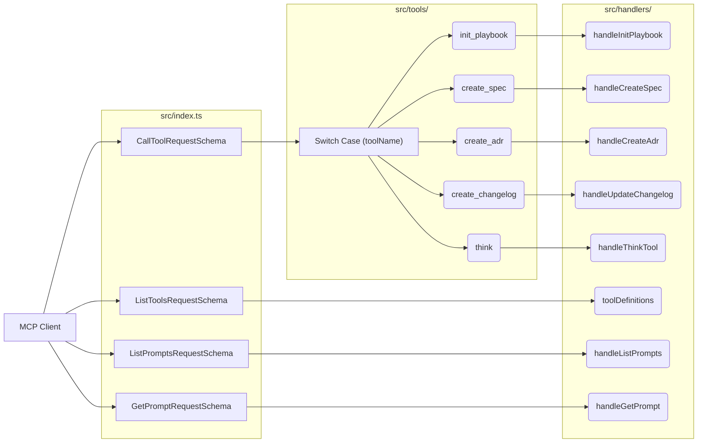

# Inloop Studio Documentation MCP

A Model Context Protocol (MCP) server for managing project documentation (Specifications, ADRs, Changelog entries) by syncing them directly to the `inloopstudio/inloop-private-docs` GitHub repository.

## Usage with MCP clients

To use this MCP server with your client (e.g., Claude Desktop, Cursor, Zed, Cline), you would add a configuration entry to your client's settings. The exact `command` and `args` will depend on how you choose to run the server (e.g., directly via `node` or using Docker).

It is recommended to include the `init_playbook` tool call as part of your client's initial setup or instructions to get guidance on how to use the documentation tools effectively.

Example configuration for your MCP client:

```json
{
  "mcpServers": {
    "mcp-playbook": {
      "command": "npx",
      "args": ["-y", "@inloopstudio/mcp-playbook@latest"],
      "env": {
        "GITHUB_PERSONAL_ACCESS_TOKEN": "your_github_token_here"
      }
    }
  }
}
```

Consult your MCP client's documentation for detailed instructions on configuring MCP servers.

## How the MCP works behind the scenes

The Inloop Studio Documentation MCP server operates by receiving tool call requests from an MCP client. These requests are processed in the `src/index.ts` file, which acts as the server's entry point.



1.  **Tool Call Request:** An MCP client sends a `CallToolRequest` to the server, specifying the `toolName` and any necessary `arguments`.-
2.  **Request Handling:** The `src/index.ts` file routes the request based on `toolName`.
3.  **Handler Execution:** Each tool call is directed to a dedicated handler function in `src/handlers.ts`.
4.  **GitHub Interaction:** The `create` handlers interact with the GitHub API (via `src/utils/githubApi.ts`) to create/update files and open Pull Requests in the `inloopstudio/inloop-private-docs` repository.
5.  **Result:** The handler function performs the requested action and returns a result to the MCP client.

This flow ensures that documentation creation requests are automatically synced to the designated GitHub repository.

## Available Tools

| Tool Name          | Description                                                                                                                                                                                                                                                              |
| :----------------- | :----------------------------------------------------------------------------------------------------------------------------------------------------------------------------------------------------------------------------------------------------------------------- |
| `init_playbook`    | Provides an instruction to the LLM about the purpose of this MCP server, which is to facilitate structured documentation creation by syncing content to the `inloopstudio/inloop-private-docs` GitHub repository.                                                        |
| `create_spec`      | Creates a new specification file (e.g., PRD, RFC, architectural planning) in the `src/content/docs/product_engineering/specs/` directory of the `inloopstudio/inloop-private-docs` repository via a Pull Request. Files are named following a `spec-name.md` convention. |
| `create_adr`       | Creates a new Architectural Decision Record (ADR) file in the `src/content/docs/product_engineering/adrs/` directory of the `inloopstudio/inloop-private-docs` repository via a Pull Request. Files are named following a `adr-name.md` convention.                      |
| `create_changelog` | Creates a new, detailed, and user-facing changelog entry file in the `src/content/docs/product_engineering/changelogs/` directory of the `inloopstudio/inloop-private-docs` repository via a Pull Request. Files are named following a `changelog-entry.md` convention.  |
| `think`            | Use the tool to think about something. It will not obtain new information or make any changes to the repository, but just log the thought. Use it when complex reasoning or brainstorming is needed.                                                                     |

## Tool Details

### `init_playbook`

Provides an instruction to the LLM about the purpose of this MCP server, which is to facilitate structured documentation creation by syncing content to the `inloopstudio/inloop-private-docs` GitHub repository.

**Parameters:**
None.

**Returns:**
A JSON object containing the instruction.

```json
{
  "instruction": "string" // Instruction for the LLM regarding the purpose of the MCP.
}
```

### `create_spec`

Creates a new specification file (e.g., PRD, RFC, architectural planning) in the `src/content/docs/product_engineering/specs/` directory of the `inloopstudio/inloop-private-docs` repository. This is done by creating a new branch, adding the file, committing the changes, and opening a Pull Request. A sequence number is automatically determined based on existing files in the target directory.

**Parameters:**

- `spec_name` (string, required): The name of the specification (used to generate the filename slug).
- `content` (string, required): The markdown content of the specification. Include frontmatter (e.g., `--- title: ..., description: ... ---`) for better organization.
- `branch_name` (string, optional): The name of the branch to use for the changes. If not provided, a name will be generated (e.g., `docs/add-spec-name`).
- `commit_message` (string, optional): The commit message for the file change. If not provided, a default message will be used.
- `pr_title` (string, optional): The title for the new Pull Request. If not provided, a default title will be used.
- `pr_body` (string, optional): The body content for the new Pull Request. Provide a comprehensive description. If not provided, a default body will be used.

**Returns:**
A JSON object indicating success or failure, including the created PR number and URL if successful.

```json
{
  "status": "success" | "error",
  "pr_number": number | undefined, // The number of the created Pull Request.
  "pr_url": string | undefined, // The URL of the created Pull Request.
  "message": string // Description of the result or error
}
```

### `create_adr`

Creates a new Architectural Decision Record (ADR) file in the `src/content/docs/product_engineering/adrs/` directory of the `inloopstudio/inloop-private-docs` repository. This is done by creating a new branch, adding the file, committing the changes, and opening a Pull Request. A sequence number is automatically determined based on existing files in the target directory.

**Parameters:**

- `adr_name` (string, required): The name of the ADR (used to generate the filename slug).
- `content` (string, required): The markdown content of the ADR. Include frontmatter (e.g., `--- title: ..., date: ... ---`) for better organization.
- `branch_name` (string, optional): The name of the branch to use for the changes. If not provided, a name will be generated (e.g., `docs/add-adr-name`).
- `commit_message` (string, optional): The commit message for the file change. If not provided, a default message will be used.
- `pr_title` (string, optional): The title for the new Pull Request. If not provided, a default title will be used.
- `pr_body` (string, optional): The body content for the new Pull Request. Provide a comprehensive description. If not provided, a default body will be used.

**Returns:**
A JSON object indicating success or failure, including the created PR number and URL if successful.

```json
{
  "status": "success" | "error",
  "pr_number": number | undefined, // The number of the created Pull Request.
  "pr_url": string | undefined, // The URL of the created Pull Request.
  "message": string // Description of the result or error
}
```

### `create_changelog`

Creates a new, detailed, and user-facing changelog entry file in the `src/content/docs/product_engineering/changelogs/` directory of the `inloopstudio/inloop-private-docs` repository. This is done by creating a new branch, adding the file, committing the changes, and opening a Pull Request. A sequence number is automatically determined based on existing files in the target directory. Entries should provide comprehensive information about changes, including how to use new features or any impact on existing functionality, rather than being brief summaries.

**Parameters:**

- `changelog_name` (string, required): The desired name for the changelog entry (used to generate the filename slug).
- `entry_content` (string, required): The markdown content of the new changelog entry. Include frontmatter (e.g., `--- title: ..., date: ... ---`) for better organization.
- `branch_name` (string, optional): The name of the branch to use for the changes. If not provided, a name will be generated (e.g., `docs/add-changelog-entry`).
- `commit_message` (string, optional): The commit message for the file change. If not provided, a default message will be used.
- `pr_title` (string, optional): The title for the new Pull Request. If not provided, a default title will be used.
- `pr_body` (string, optional): The body content for the new Pull Request. Provide a comprehensive description. If not provided, a default body will be used.

**Returns:**
A JSON object indicating success or failure, including the created PR number and URL if successful.

```json
{
  "status": "success" | "error",
  "pr_number": number | undefined, // The number of the created Pull Request.
  "pr_url": string | undefined, // The URL of the created Pull Request.
  "message": string // Description of the result or error
}
```

### `think`

Use the tool to think about something. It will not obtain new information or make any changes to the repository, but just log the thought. Use it when complex reasoning or brainstorming is needed.

**Parameters:**

- `thought` (string, required): Your thoughts.

**Returns:**
A JSON object containing the thought that was processed.

```json
{
  "content": [
    {
      "type": "text",
      "text": "string" // Your processed thought here
    }
  ]
}
```

Or, if an error occurs:

```json
{
  "isError": true,
  "content": [
    {
      "type": "text",
      "text": "Error: Invalid arguments: Your error message"
    }
  ]
}
```

## Setup

### Local Development

1.  Clone the repository:
    ```bash
    git clone git@github.com:inloopstudio-team/mcp-playbook.git # Note: Repository name is still mcp-playbook
    cd mcp-playbook
    ```
2.  Install dependencies:
    ```bash
    npm install
    ```
3.  Build the project:
    ```bash
    npm run build # This compiles TypeScript to JavaScript in the 'dist' directory
    ```
4.  Configure GitHub Authentication (see Configuration section below).
5.  Run the compiled server:
    ```bash
    node dist/src/index.js
    ```

### Running with Docker (Optional)

A `Dockerfile` is included for building a Docker image. Build and run the Docker image:

1.  Build the Docker image:
    ```bash
    docker build -t inloop-docs-mcp .
    ```
2.  Run the container, ensuring the `GITHUB_PERSONAL_ACCESS_TOKEN` environment variable is passed:
    ```bash
    docker run --pull=always -e GITHUB_PERSONAL_ACCESS_TOKEN="your_token" inloop-docs-mcp
    ```

## Configuration

The MCP requires a GitHub Personal Access Token with `repo` scope to create branches, commit files, and open Pull Requests in the `inloopstudio/inloop-private-docs` repository. This token must be provided via the `GITHUB_PERSONAL_ACCESS_TOKEN` environment variable.

For local development, you can use a `.env` file in the project root:

```dotenv
GITHUB_PERSONAL_ACCESS_TOKEN=your_github_token_here
```

Ensure `.env` is added to your `.gitignore` file.

## Usage Example

```
mcp_inloop-docs-mcp_create_spec(spec_name="Initial Design", content="# Initial Design Specification\n\nThis document outlines the initial design of the project...", branch_name="docs/initial-design-spec", pr_title="docs: Add initial design specification")
```

## Troubleshooting

- **Environment Variable Not Set**: Ensure the `GITHUB_PERSONAL_ACCESS_TOKEN` environment variable is correctly set in the environment where the MCP server process is running.
- **GitHub API Errors**: If a `create` tool fails, check the server logs for details from the `githubApi.ts` error handling. Common issues include incorrect tokens, insufficient permissions, or rate limiting when interacting with `inloopstudio/inloop-private-docs`.
- **File Path Issues (Internal)**: The server constructs file paths within `src/content/docs/product_engineering/` based on the tool used and the provided name. Ensure the `baseRepoPath` variables in the handlers are correct (`specs`, `adrs`, `changelogs`).

## Handoff Guidance for Another Engineer

- **Core Functionality:** This MCP server is now specifically designed to sync documentation (specs, ADRs, changelogs) for Inloop Studio to the `inloopstudio/inloop-private-docs` GitHub repository, specifically within `src/content/docs/product_engineering/`.-
- **GitHub API:** All documentation creation/syncing logic relies on direct interaction with the GitHub API via `src/utils/githubApi.ts`. Familiarity with this file and the GitHub API documentation is essential for modifying or debugging the `create` handlers.
- **Fixed Target Repository:** The target GitHub repository (`inloopstudio/inloop-private-private-docs`) and the base path within it (`src/content/docs/product_engineering/`) are currently hardcoded in the `create` handlers. If this needs to be configurable in the future, these handlers will require modification.
- **Sequence Numbering:** The logic for determining the next sequence number for documentation files (`0001-...`) is implemented by listing existing files in the target GitHub directory via the API.
- **Dependencies:** Ensure all `npm` dependencies are installed (`npm install`). The project uses TypeScript; compile with `npm run build` (or `npx tsc`).
- **Authentication:** GitHub authentication relies solely on the `GITHUB_PERSONAL_ACCESS_TOKEN` environment variable.
